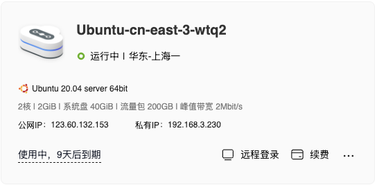
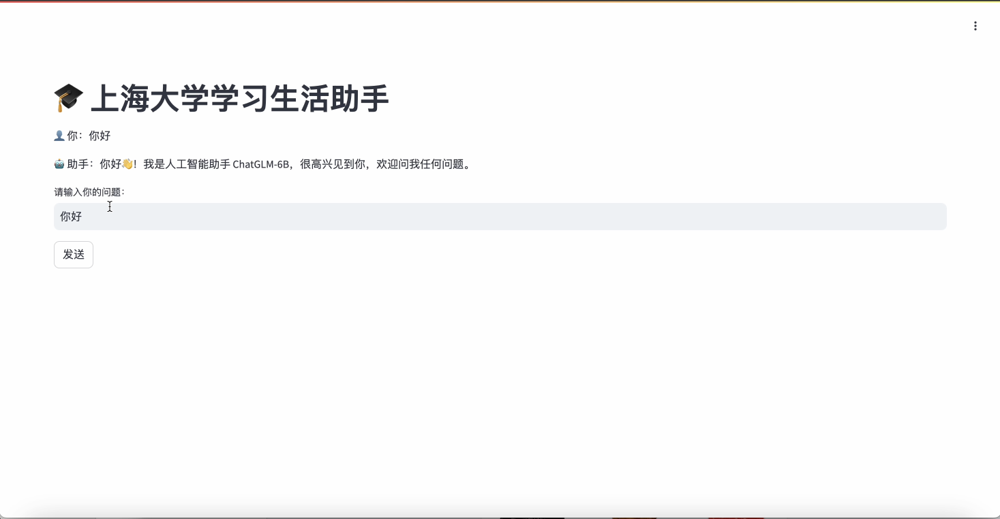
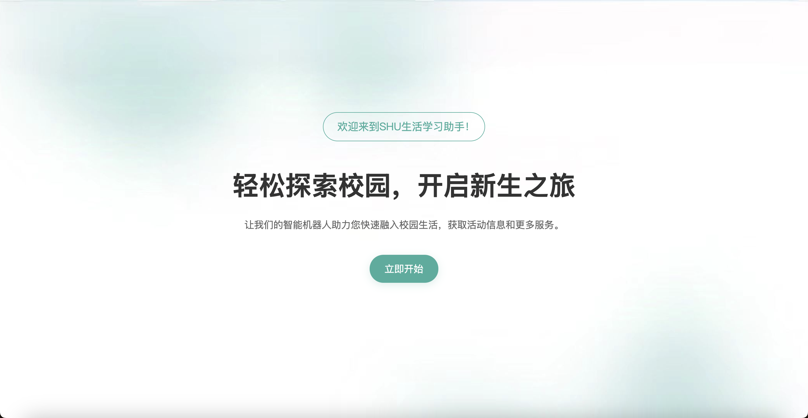
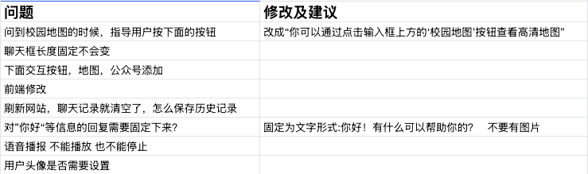

## 四 开发过程

### 4.1 嵌入式数据库

#### 4.1.1 数据库构建

通过自动化脚本，将小组成员搜集到的相关 Excel 格式数据转化成 JSON 格式数据，并存储到 json 文件中。

```python
def excel_to_json(excel_file, json_file):
    try:
        # 读取 Excel 文件
        df = pd.read_excel(excel_file)
        df.columns = df.columns.astype(str)
        # 转换为 JSON
        json_data = df.to_json(json_file, force_ascii=False, orient='records', indent=4)
        
    except Exception as e:
        print(f"发生错误: {str(e)}")
```
<p align="center"><font color="#808080" size="2">python脚本</font></p>

```JSON
{
    "问题类型": "宿舍生活",
    "具体问题": "南区宿舍的修车点在哪里",
    "标准回答": "南区大门进门左转小巷子里、南区十号楼入口处",
    "关键词": "修车",
    "补充说明": null,
    "图片": null,
    "图片路径": "企创图片资料/校内修车铺及配钥匙点相关介绍.jpg"
}
```
<p align="center"><font color="#808080" size="2">JSON数据</font></p>


#### 4.1.2 数据库查询
通过向量检索技术，将用户的问题与数据库中的数据进行匹配，并返回最相关的数据。

```python
def get_context(self, query, top_k = 5):
    query_embedding = self.model.encode([query])
    similarities = cosine_similarity(query_embedding, self.question_embeddings)[0]
    # 获取相似度最高的top_k个数据
    top_indices = similarities.argsort()[-top_k:][::-1]
```
<p align="center"><font color="#808080" size="2">查询RAG系统</font></p>

### 4.2 环境搭建与配置

#### 4.2.1 服务器部署与配置

在项目的初期阶段，我们选择了华为云服务器进行部署。为了确保系统的稳定性和安全性，我们进行了详细的服务器配置。虽然没有使用域名，我们通过 IP 地址进行访问，并配置了 HTTPS 以保护数据传输的安全性。这一过程涉及到服务器环境的搭建，包括操作系统的选择、必要软件的安装以及网络安全设置。通过这些配置，我们确保了系统能够在云环境中稳定运行，并为后续的开发和测试提供了可靠的基础设施。

<div>
           
           <p align="center"><font color="#808080" size="2">服务器部署</font></p>
   </div>

#### 4.2.2 API 接口设计与开发

在后端开发中，我们使用 FastAPI 构建了 API 接口，以处理用户请求并实现与前端的交互。API 的设计注重简洁性和高效性，确保能够快速响应用户的查询请求。我们定义了清晰的接口规范，涵盖了数据的输入输出格式、错误处理机制以及安全认证措施。通过这些设计，我们实现了后端与前端的无缝连接，为用户提供了流畅的交互体验。

```python
@app.post("/chat")
async def ask(question: Question):
    async def generate():
        async for chunk in qa_system.get_answer_stream(question.question, question.session_id):
            yield chunk
    
    return StreamingResponse(generate(), media_type='text/event-stream')

@app.get("/")
async def root():
    return {"message": "上海大学智能问答系统API"}
```

### 4.3 模型训练与测试

#### 4.3.1 模型选择与集成

在模型选择阶段，我们最初采用了 ChatGLM 模型，并使用量化 4 版本以降低成本。为了快速验证模型的基本功能，我们使用 Streamlit 快速集成了前后端，构建了一个测试网页。然而，在测试过程中，我们发现模型在处理复杂问题时效果不佳。经过多次评估，我们最终选择了 DeepSeek V3 模型，该模型在回答准确性和响应速度方面表现优异。

<div>
           
           <p align="center"><font color="#808080" size="2">streamlit测试网页</font></p>
   </div>

#### 4.3.2 使用向量检索进行语义匹配优化

为了提升模型的语义匹配能力，我们引入了向量检索技术。通过使用 SentenceTransformer 对文本进行向量化处理，我们能够更准确地捕捉用户问题的语义特征。结合 FAISS 进行高效的余弦相似度搜索，我们优化了模型的语义匹配能力，使其能够更准确地理解和回答用户的问题。

```python
def __init__(self, json_file):
        self.model = SentenceTransformer('paraphrase-multilingual-MiniLM-L12-v2')
        query_embedding = self.model.encode([query])
        # 计算余弦相似度
        similarities = cosine_similarity(query_embedding, self.question_embeddings)[0]
        top_indices = similarities.argsort()[-top_k:][::-1]
```
<p align="center"><font color="#808080" size="2">向量检索</font></p>

### 4.4 前端与后端集成

#### 4.4.1 前端交互实现

在正式前端开发中，我们使用了 React 和 Tailwind CSS 等技术，设计并实现了用户界面。界面设计注重用户体验，并确保了响应的美观性和一致性。通过与后端 API 的集成，我们实现了实时对话交互和动态内容展示，为用户提供了流畅的使用体验。

<div>
           
           <p align="center"><font color="#808080" size="2">初步前端界面</font></p>
</div>

### 4.5 优化测试阶段

在项目的各个阶段，我们进行了广泛的优化工作，以确保系统的性能和用户体验达到最佳状态。我们不断调整参数和优化代码，以提高系统的响应速度和准确性。且小组成员不断测试，通过用户反馈，我们识别了改进点，并进行了多次迭代和优化。我们还引入了新功能，并对前端设计进行了多次改进，以确保系统的易用性和美观性。

<div>
           
           <p align="center"><font color="#808080" size="2">优化测试阶段</font></p>
</div>
