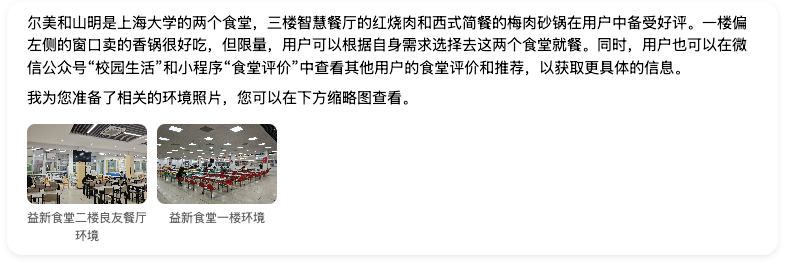
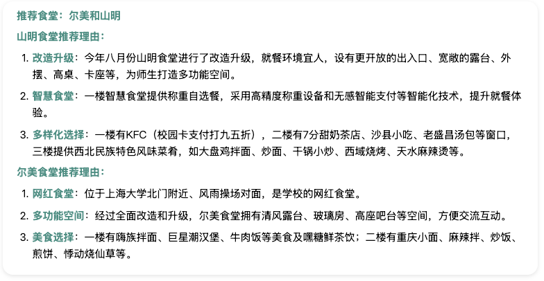
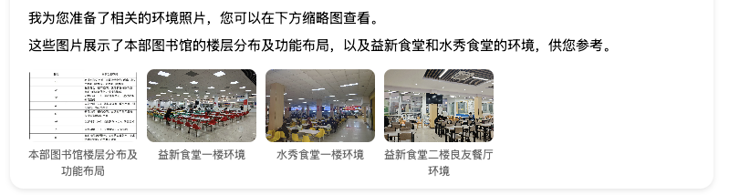
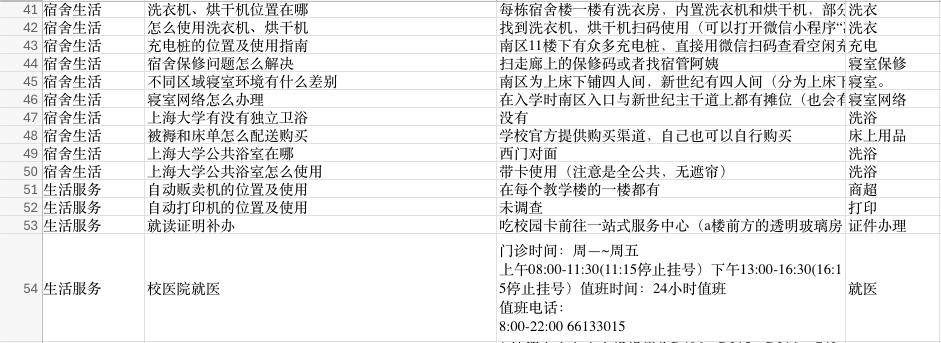

## 5 遇到的问题及对策

在项目开发过程中，我们遇到了多个挑战，并通过创新的解决方案成功克服了这些问题。

### 5.1 模型效果不佳

   初始选择的 ChatGLM 模型在处理复杂问题时效果不佳，尤其是在参数调整和不同的 prompt 下，模型的回答仍然不够准确。为了解决这一问题，我们决定采用 DeepSeek V3 模型。该模型不仅成本低，而且在回答准确性和响应速度方面表现优异。通过这一更换，我们显著提升了系统的性能。
   

       

           
           
ChatGLM: 并没有说明具体情况，将两个食堂搞混淆，捏造信息

       

       

           
           
DeepSeek V3: 说明详细情况，清晰的区分了两个食堂，个性化推荐

       

   

### 5.2 图片与文字混合生成

   现行的 LLM 模型在处理图片与文字混合生成时，格式常常混乱，无法提供美观的输出，并且大部分图片都是AI生成而非真实图片。为了解决这一问题，我们的团队实现了在回复问题时附带相应图片的功能，并通过正则匹配、前端渲染和后端标记等技术，统一了输出格式，实现了缩略图与大图的切换，使其更加美观。尽管在渲染过程中遇到了不稳定的问题，我们通过不断的修复和测试，最终实现了稳定的输出。
   

           
           
缩略图与大图切换

   

### 5.3 数据采集挑战

   为了打造一个关于上海大学的生活学习助手，我们需要独一无二的数据，这些数据是其他 LLM 无法提供的。为此，我们的小组成员通过发放问卷、实地调查和开会讨论，收集了大量宝贵的数据。按照问题类型，有食堂攻略，宿舍生活，生活服务，社团活动，选课指导......这些数据为我们的系统提供了独特的内容支持，使其能够更好地服务于用户。
   

           
           
数据采集

   

通过这些创新的解决方案，我们不仅解决了开发过程中遇到的各种问题，还为系统的功能和用户体验带来了显著的提升。
