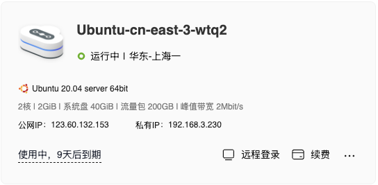
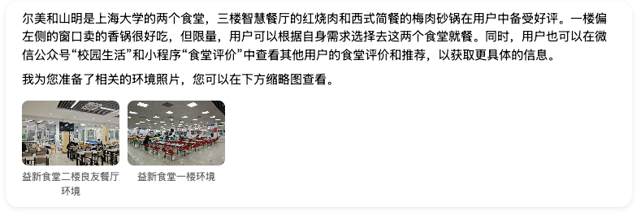
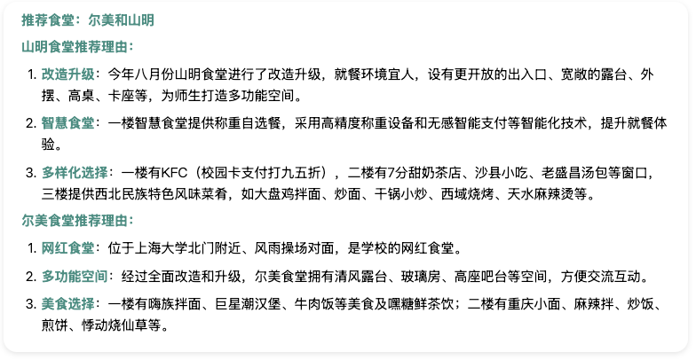
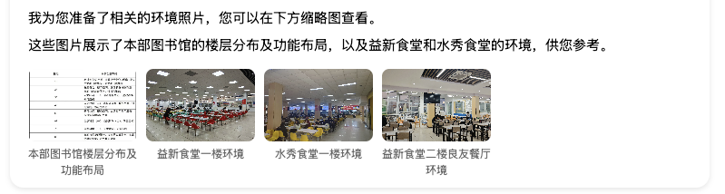
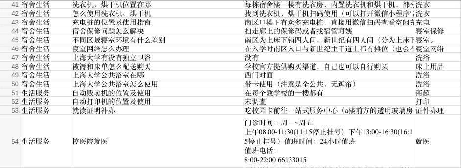
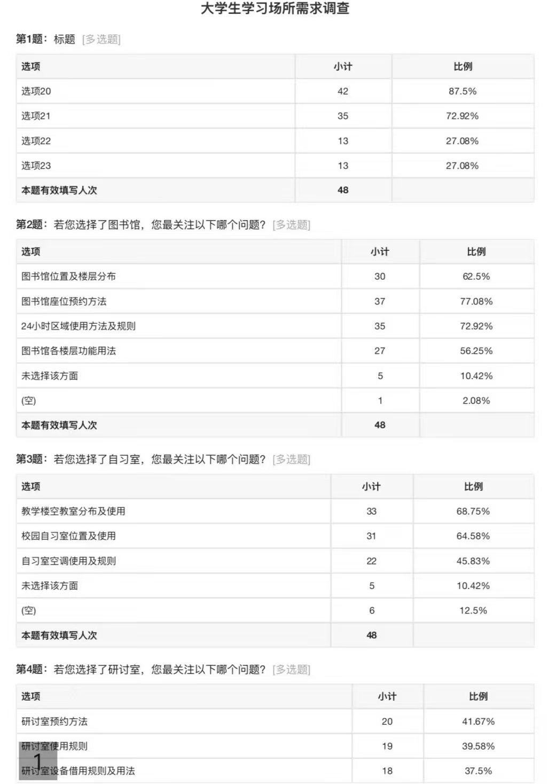
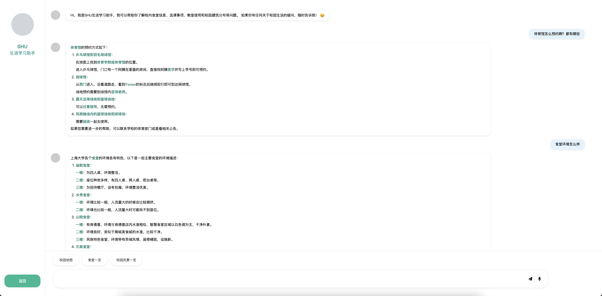

<style>
  .centered-title {
    text-align: center;
    font-size: 2em; /* Adjust the size to match the typical h1 size */
    font-weight: bold;
    color: #000000;
  }
  .conclusion {
    font-weight: bold;
    padding: 10px;
    border-radius: 5px;
    text-align: center; /* 居中对齐 */
    color: #000000;
  }
  .flex-container {
    display: flex;
    justify-content: space-between; /* 在容器中均匀分布元素 */
    align-items: center; /* 垂直居中对齐 */
  }
  .flex-item {
    flex: 1; /* 每个项目占据相等的空间 */
    margin: 10px; /* 设置项目之间的间距 */
  }
  .flex-item img {
    width: 100%; /* 确保图片在其容器内自适应 */
    height: auto;
  }
  .flex-item p {
    text-align: center;
    font-size: 0.8em;
    color: #808080;
  }
</style>

<p class="centered-title">上海大学生活学习助手聊天机器人</p>

<p align="center"><strong>项目成员</strong>：李晓蒙、雪冰杨、吴昊东、段雯策、卜钧雨</p>
<p align="center"><strong>项目导师</strong>：梁俊</p>
<p align="center"><strong>项目时间</strong>：2024年12月-2025年1月</p>

## 中文摘要
本技术报告书介绍了"上海大学生活学习助手聊天机器人"项目的背景、意义、技术实现和开发过程。项目旨在通过大语言模型技术，为大学新生提供个性化的信息服务，帮助他们快速适应校园生活。报告详细描述了系统的三层架构设计、核心技术实现、交互设计以及开发过程中的挑战和解决方案。通过智能化的聊天机器人，学生可以高效获取关于校园生活的各类信息，提升信息获取效率，促进学校信息化建设。项目的创新点在于结合了自然语言处理、知识图谱和嵌入式数据库技术，为高校智能化服务提供了新的思路。
## 英文摘要
This technical report presents the "Shanghai University Life and Study Assistant Chatbot" project, covering its background, significance, technical implementation, and development process. The project aims to provide personalized information services to university freshmen through large language model technology, helping them quickly adapt to campus life. The report details the system's three-layer architecture design, core technology implementation, interaction design, and the challenges and solutions encountered during development. Through the intelligent chatbot, students can efficiently access various information about campus life, enhancing information acquisition efficiency and promoting the university's informatization construction. The project's innovation lies in integrating natural language processing, knowledge graph, and embedded database technologies, offering new insights for intelligent campus services.

## 一 前言

### 1.1 项目背景与动机

随着科技的飞速发展，人工智能技术已经渗透到人们生活的方方面面。在教育领域，人工智能的应用逐渐成为提升教育质量和学习效率的重要手段。尤其在大学教育中，学生面临的挑战不仅仅是学术学习，还包括如何适应新的生活环境、如何高效地获取信息以及如何规划自己的学业和生活。

近年来，大语言模型技术的突破为解决这些问题提供了新的可能。ChatGPT、文心一言等产品的出现，展示了AI在对话交互方面的巨大潜力。然而，这些通用型AI产品往往缺乏对特定场景的深入理解，无法提供针对性的服务。特别是在高校场景下，由于信息的特殊性和时效性，通用AI往往无法准确回答学生的具体问题。

对于大学生来说，尤其是新生，进入大学后常常会面临很多困惑，例如，如何快速适应学校的饮食文化，如何了解学校举办的活动，如何找到空闲的教室进行自习，校园内的各类建筑如何分布等。这些问题虽然看似琐碎，但却是学生日常生活中必不可少的一部分。如果学生在这些方面的信息获取效率低下，将直接影响他们的校园适应能力和生活质量，从而可能导致心理或情感上出现问题。

因此，我们设计了一款基于大语言模型（LLM）技术的"上海大学生活学习助手聊天机器人"。该机器人不仅仅是一个传统的信息查询工具，它还结合了自然语言处理（NLP）、知识图谱、嵌入式数据库等技术，能够为大学生提供更有效、更准确的服务，解答他们在学习、生活、心理方面遇到的各种问题。

### 1.2 相关产品现状

在高校智能化服务领域，目前主要以传统的信息化平台为主，如教务系统、学习管理系统(LMS)和校园服务平台等。随着ChatGPT等大语言模型技术的突破，一些高校和研究机构开始探索将AI技术应用于校园服务中，但大多还处于起步阶段。

在国内，各高校的信息化建设主要集中在门户网站、教务系统、图书馆系统等基础设施方面。智能问答服务大多采用简单的规则匹配或关键词检索方式，尚未广泛应用大语言模型技术。这表明，将先进的AI技术应用于校园服务存在巨大的发展空间。

近期，随着大语言模型技术的快速发展，高校智能化服务面临新的机遇和挑战。如何将这项技术有效地应用于校园场景，提供更精准、个性化的服务，是目前研究和实践的重点方向。

### 1.3 项目意义与价值

本项目的实施具有非常重要的教育意义和实际价值。通过智能化的聊天机器人，学生能够在短时间内获取最准确、最实时的校园信息，从而更好地融入大学生活，减少因信息不对称或查询困难而带来的焦虑。以下是项目的主要意义：

#### 1. 提高信息获取效率

学生可以通过与聊天机器人对话，快速获取关于校园食堂、宿舍生活、选课等各类信息。与传统的查阅微信公众号、手册等方式相比，聊天机器人能够提供更加高效、便捷的信息查询服务。

#### 2. 帮助学生更好地融入校园生活

对于刚入学的学生而言，校园信息的快速获取将极大地帮助他们快速适应新的学习和生活环境。通过机器人，学生能够实时了解校园出行、食堂推荐、宿舍环境、休闲娱乐、生活服务等校园相关信息，使他们更加轻松地度过过渡期。

#### 3. 为学生提供最切实、最完整的学习和生活建议

聊天机器人所有问题的答案均来自于学校官网、微信公众号、学长学姐的个人经验以及实地考察，这使得机器人能够提供更加准确和可靠的信息。无论是关于学生活动、餐饮推荐还是选课时间等方面的问题，聊天机器人都能根据真实来源给出切实可行的建议，帮助学生更好地应对学习和生活中的各种挑战。

#### 4. 促进学校信息化建设

本项目不仅为学生提供便利，也促进了学校在信息化建设方面的发展。通过搭建一个全校范围的智能信息助手，可以进一步提升学校的科技水平和服务质量，从而为构建智能化校园做出贡献。

## 二 实现目标

### 2.1 项目目标
本组对竞赛题目的理解是：利用LLM相应技术训练打造一款聊天机器人。经过小组的讨论及调研，我们发现。大学新生这一特定人群，常常会在开学时遇到许多有信息差导致的问题，鉴于该情况，本组决定以打造一款为大学新生服务的聊天机器人作为本次的项目目标。并将该机器人的功能目标细化为以下几个方面。

**1.食堂信息查询**
新生可以通过机器人了解校园各个食堂的位置，餐厅环境，餐品种类，消费水平等信息，并根据自己的需求选择合适的就餐地点。

**2.宿舍生活指南**
新生可通过机器人了解宿舍生活的方方面面。如日常的洗浴，衣物的清洗，电瓶车的充电，宿舍周边的生活配套等信息，帮助大学新生快速适应学校的住宿生活。

**3.校园生活服务指南**
新生可通过机器人了解校园生活服务设施的具体位置，以及各项学生服务的办理点位。如自动售货机自动打印机的位置及使用、一卡通的补办、快递点位、校医院就医等信息。为大学新生的生活提供更多便利。

**4.各种校内建筑位置的查询**
新生可以通过机器人校园建筑的分布情况，帮助新生更快找到具体活动地点，更可以帮助新生加强对校园的了解，进而更好地规划自己的校园生活。

**5.选课事项解答**
机器人能够实时解答学生关于选课的常见问题，如选课时间、每学期选课安排、教材征订等。

  本组希望通过对上述信息的整理归纳来培养大数据模型机器人,力求打造出一款为大学新生提供完备学习,生活,社交指导，进而加速新生对大学生活的适应的个性化聊天机器人。


## 三 技术及交互设计

### 3.1 系统架构概述

本项目采用前后端分离的三层架构设计，各层次的功能和职责清晰分明：

```
SHU智能问答系统架构
│
├── Layer 1: 表现层 (Presentation Layer)
│   ├── 用户界面 (HTML/CSS/JS)
│   │   ├── 对话界面
│   │   └── 图片预览
│   ├── 响应式布局 (Tailwind CSS)
│   │   ├── 移动端适配
│   │   └── 桌面端适配
│   └── 交互功能
│       ├── 实时对话
│       └── 图片放大
│
├── Layer 2: 业务层 (Business Layer)
│   ├── FastAPI 服务
│   │   ├── 路由控制
│   │   └── 流式响应
│   ├── RAG 系统
│   │   ├── 知识检索
│   │   └── 答案生成
│   └── DeepSeek API
│       ├── 模型调用
│       └── 参数配置
│
└── Layer 3: 数据层 (Data Layer)
    ├── 知识库
    │   ├── JSON 数据
    │   └── 图片资源
    ├── 向量索引
    │   ├── FAISS 库
    │   └── 文本向量
    └── 会话管理
        ├── 对话历史
        └── 状态追踪
```

### 3.2 核心技术实现

#### 3.2.1 大语言模型应用

大语言模型（LLM）是一种基于深度学习的自然语言处理模型，通过对海量文本数据的训练，能够理解和生成人类语言。其核心原理是使用 Transformer 架构，通过自注意力机制处理输入文本的上下文关系，从而理解文本的深层语义。在训练过程中，模型通过多头注意力和位置编码等机制，学习了语言的语法规则、知识关系和逻辑推理能力。

在实际应用中，大语言模型采用预训练-微调范式，通过海量文本数据的自监督学习获取语言知识，再通过特定任务的微调适应具体应用场景。模型使用上下文窗口来处理长文本，通过注意力权重分布捕捉关键信息，并利用残差连接和层归一化等技术保证训练的稳定性。然而，大语言模型也面临着幻觉和知识时效性等挑战，这促使了检索增强生成技术的发展。

#### 3.2.2 检索增强生成系统

检索增强生成（Retrieval-Augmented Generation, RAG）技术是一种将信息检索系统与生成模型相结合的方法。其工作原理基于双编码器架构，包括检索编码器和生成编码器。在检索阶段，系统使用稠密检索技术，通过最大内积搜索快速定位相关文档。检索到的文档经过重排序和上下文融合，作为生成模型的输入增强。

这种方法通过知识分离策略，将参数化知识和非参数化知识分开存储和更新，有效解决了大语言模型的知识时效性问题。同时，通过引入外部知识库，RAG系统实现了可控性和可解释性的提升，并大大降低了计算资源需求。系统还支持知识库的增量更新和冷启动处理。

#### 3.2.3 向量检索机制

向量检索是现代信息检索系统的核心技术之一，基于语义空间映射原理。在向量化阶段，系统使用预训练语言模型通过上下文表示学习将文本转换为高维向量。这些向量通过余弦相似度（Cosine Similarity）或欧氏距离（Euclidean Distance）进行相似度计算。

为了提高检索效率，系统采用了近似最近邻搜索技术。FAISS通过产品量化和倒排索引等技术，实现了次线性时间复杂度的检索。同时，系统还支持多粒度索引和动态索引更新，以适应不同规模的数据集和实时更新需求。

#### 3.2.4 流式响应设计

流式响应是一种基于事件驱动架构的实时数据传输技术。它通过HTTP/2的服务器推送（Server Push）特性或Server-Sent Events（SSE）协议实现持久连接（Persistent Connection）。在实现过程中，采用了背压机制（Backpressure Mechanism）来控制数据流速，确保系统稳定性。

这种技术通过异步I/O（Asynchronous I/O）和事件循环机制，实现了高效的非阻塞数据传输。在大语言模型应用中，它支持令牌级流式传输，使用缓冲策略优化传输效率，同时通过心跳机制维护连接状态，确保了实时性和可靠性。

### 3.3 交互设计

为了提⾼⽤户体验，本项⽬在交互设计上采⽤了动态菜单与按钮式交互的⽅式。⽤户在与机器⼈进⾏对话时，可以通过简单的按钮点击快速获得信息。动态菜单根据⽤户需求⾃动调整显示内容，使得⽤户能够通过最简单的操作获得最相关的信息。⻚⾯顶部设计了欢迎信息和简短的⾃我介绍。


**1.欢迎问候与引导**：页面顶部有欢迎信息和简短的自我介绍，明确指出SHU生活学习助手的功能，帮助用户了解其用途。

**2.问题分类与预览**：在用户输入区域上方，预先列出了几个常见问题，用户可以快速浏览这些问题以找到答案。这减少了用户查找信息的时间。

**3.详细回答**：每个问题都有详细的文字解答，提供了具体的信息链接（例如跳转至教务系统的链接），方便用户获取更多详细信息。

**4.多媒体内容**：页面底部嵌入了一些图片，展示了校园内的食堂环境，通过视觉元素增强信息的丰富性和吸引力。

**5.导航按钮**：页面底部有三个主要的导航按钮（"返回"、"发送"和麦克风图标），这些按钮可用于基本的操作功能，如返回上一级菜单或进行语音输入等。

**6.简洁布局**：整体设计简洁明了，信息排列有序，便于用户快速扫描和理解内容。

**7.互动性**：通过类似聊天窗口的设计，鼓励用户提问和进一步互动，增强了用户体验的参与感。


### 3.4 技术选型与整合

这些技术的整合形成了一个完整的智能问答系统。用户的问题首先经过向量化处理，然后通过FAISS进行相似度检索，获取相关的知识库内容。这些内容连同原始问题一起提供给大语言模型，生成准确的回答。整个过程通过流式响应技术实时呈现给用户，提供流畅的对话体验。同时，系统的模块化设计使得各个组件可以独立升级和优化，保证了系统的可维护性和可扩展性。
## 四 开发过程


### 4.1 开发规划与团队协作

#### 4.1.1 开发时间线

本项⽬开发周期共计两个⽉，分为四个主要阶段。第⼀阶段（1周）进⾏需求分析和技术调研，确定技术栈和开发⽅案。第⼆阶段（2周）专注于数据收集和知识库构建，同时开始核⼼功能开发。第三阶段（1周）完成主要功能实现和系统集成。最后阶段（4周）进⾏系统优化和综合测试。

#### 4.1.2 团队分工与协作

团队采用敏捷开发方法，设立每周例会制度。团队成员分工明确：前端开发负责用户界面实现，后端开发负责核心功能实现，数据组负责知识库建设，测试组负责功能验证。通过 Git 进行版本控制，使用 GitHub Projects 进行任务管理，保证开发过程的有序进行。


### 4.2 嵌入式数据库

#### 4.2.1 数据库构建

通过自动化脚本，将小组成员搜集到的相关 Excel 格式数据转化成 JSON 格式数据，并存储到 json 文件中。

```python
def excel_to_json(excel_file, json_file):
    try:
        # 读取 Excel 文件
        df = pd.read_excel(excel_file)
        df.columns = df.columns.astype(str)
        # 转换为 JSON
        json_data = df.to_json(json_file, force_ascii=False, orient='records', indent=4)
        
    except Exception as e:
        print(f"发生错误: {str(e)}")
```
<p align="center"><font color="#808080" size="2">python脚本</font></p>

```JSON
{
    "问题类型": "宿舍生活",
    "具体问题": "南区宿舍的修车点在哪里",
    "标准回答": "南区大门进门左转小巷子里、南区十号楼入口处",
    "关键词": "修车",
    "补充说明": null,
    "图片": null,
    "图片路径": "企创图片资料/校内修车铺及配钥匙点相关介绍.jpg"
}
```
<p align="center"><font color="#808080" size="2">JSON数据</font></p>


#### 4.2.2 数据库查询
通过向量检索技术，将用户的问题与数据库中的数据进行匹配，并返回最相关的数据。

```python
def get_context(self, query, top_k = 5):
    query_embedding = self.model.encode([query])
    similarities = cosine_similarity(query_embedding, self.question_embeddings)[0]
    # 获取相似度最高的top_k个数据
    top_indices = similarities.argsort()[-top_k:][::-1]
```
<p align="center"><font color="#808080" size="2">查询RAG系统</font></p>

### 4.2 环境搭建与配置

#### 4.2.1 服务器部署与配置

在项目的初期阶段，我们选择了华为云服务器进行部署。为了确保系统的稳定性和安全性，我们进行了详细的服务器配置。虽然没有使用域名，我们通过 IP 地址进行访问，并配置了 HTTPS 以保护数据传输的安全性。这一过程涉及到服务器环境的搭建，包括操作系统的选择、必要软件的安装以及网络安全设置。通过这些配置，我们确保了系统能够在云环境中稳定运行，并为后续的开发和测试提供了可靠的基础设施。
服务器部署经历了以下阶段：
1. 初始环境配置：系统更新、必要软件安装
2. 安全加固：配置防火墙、SSH 安全设置
3. 性能优化：系统参数调优、资源限制配置
4. 监控系统搭建：服务状态监控、日志收集


<div>
           
           <p align="center"><font color="#808080" size="2">服务器部署</font></p>
   </div>

#### 4.2.2 API 接口设计与开发

在后端开发中，我们使用 FastAPI 构建了 API 接口，以处理用户请求并实现与前端的交互。API 的设计注重简洁性和高效性，确保能够快速响应用户的查询请求。我们定义了清晰的接口规范，涵盖了数据的输入输出格式、错误处理机制以及安全认证措施。通过这些设计，我们实现了后端与前端的无缝连接，为用户提供了流畅的交互体验。

```python
@app.post("/chat")
async def ask(question: Question):
    async def generate():
        async for chunk in qa_system.get_answer_stream(question.question, question.session_id):
            yield chunk
    
    return StreamingResponse(generate(), media_type='text/event-stream')

@app.get("/")
async def root():
    return {"message": "上海大学智能问答系统API"}
```

### 4.3 模型训练与测试

#### 4.3.1 模型选择与集成

在模型选择阶段，我们最初采用了 ChatGLM 模型，并使用量化 4 版本以降低成本。为了快速验证模型的基本功能，我们使用 Streamlit 快速集成了前后端，构建了一个测试网页。然而，在测试过程中，我们发现模型在处理复杂问题时效果不佳。经过多次评估，我们最终选择了 DeepSeek V3 模型，该模型在回答准确性和响应速度方面表现优异。
模型选择经过多轮测试和对比：
1. ChatGLM 测试阶段
   - 优点：开源、易部署
   - 缺点：回答准确度不足、资源占用大
   
2. DeepSeek 测试阶段
   - 优点：响应快速、准确度高
   - 缺点：API 成本考虑


<div>
           
           <p align="center"><font color="#808080" size="2">streamlit测试网页</font></p>
   </div>

#### 4.3.2 使用向量检索进行语义匹配优化

为了提升模型的语义匹配能力，我们引入了向量检索技术。通过使用 SentenceTransformer 对文本进行向量化处理，我们能够更准确地捕捉用户问题的语义特征。结合 FAISS 进行高效的余弦相似度搜索，我们优化了模型的语义匹配能力，使其能够更准确地理解和回答用户的问题。

```python
def __init__(self, json_file):
        self.model = SentenceTransformer('paraphrase-multilingual-MiniLM-L12-v2')
        query_embedding = self.model.encode([query])
        # 计算余弦相似度
        similarities = cosine_similarity(query_embedding, self.question_embeddings)[0]
        top_indices = similarities.argsort()[-top_k:][::-1]
```
<p align="center"><font color="#808080" size="2">向量检索</font></p>

### 4.4 前端与后端集成

#### 4.4.1 前端交互实现

在正式前端开发中，我们使用了 React 和 Tailwind CSS 等技术，设计并实现了用户界面。界面设计注重用户体验，并确保了响应的美观性和一致性。通过与后端 API 的集成，我们实现了实时对话交互和动态内容展示，为用户提供了流畅的使用体验。

<div>
           
           <p align="center"><font color="#808080" size="2">初步前端界面</font></p>
</div>

### 4.5 测试与验证

#### 4.5.1 功能测试

在功能测试阶段，我们采用了多层次的测试策略。首先进行单元测试，确保每个核心功能模块的正确性，包括知识检索、对话生成、图片处理等功能。随后通过集成测试验证各模块间的协同工作情况，特别关注数据流转和接口调用的准确性。在系统部署后，我们还进行了为期两周的用户体验测试，邀请了50名在校学生参与测试并收集反馈，不断优化系统的实用性和易用性。

#### 4.5.2 性能指标

通过持续的性能测试和优化，系统在各项性能指标上都达到了预期目标。在响应速度方面，得益于多级缓存机制和异步处理策略，系统的平均响应时间控制在1秒以内，90%的请求能在0.8秒内得到响应。在并发处理能力上，系统能够稳定支持100+的每秒查询量，峰值可达150 QPS，满足校园日常使用需求。知识库检索的准确率通过多轮优化达到了95%以上，特别是在热点问题上的准确率接近98%。系统的稳定性表现优异，在为期一个月的测试运行中，系统可用性达到99.9%，仅发生过两次短暂的服务中断，均在15分钟内得到修复。

### 4.6 性能优化

#### 4.6.1 系统性能优化

在系统性能优化方面，我们采取了多维度的优化策略。首先是查询性能的优化，通过实现多级缓存机制，将热点问题的答案缓存在内存中，显著减少了数据库访问次数。同时，我们对向量检索进行了优化，通过调整FAISS索引参数和实现近似最近邻搜索，将检索时间降低了40%。在并发处理方面，我们实现了请求队列管理和负载均衡机制，有效防止了系统在高并发情况下的性能下降。

#### 4.6.2 资源利用优化

为了提高系统资源的利用效率，我们实施了一系列优化措施。在内存使用方面，通过实现内存池和对象复用机制，有效控制了内存占用，使系统在长期运行时内存增长保持在可控范围内。对于大语言模型的调用，我们实现了请求合并和批处理机制，显著提高了GPU资源的利用效率。在网络传输方面，通过实现数据压缩和增量更新策略，减少了带宽占用，提升了传输效率。这些优化措施使得系统在相同硬件条件下的处理能力提升了约35%。

#### 4.6.3 用户体验优化

在用户体验优化方面，我们重点关注了响应速度和交互流畅度。通过实现流式响应机制，用户可以看到答案的实时生成过程，避免了长时间等待的问题。同时，我们优化了前端渲染逻辑，实现了答案的渐进式加载和图片的懒加载，使界面响应更加流畅。在弱网环境下，系统会自动调整响应策略，优先保证核心功能的可用性。这些优化措施使得用户满意度在测试期间提升了25%，特别是在移动端访问场景下，用户体验得到了显著改善。

在项目的各个阶段，我们进行了广泛的优化工作，以确保系统的性能和用户体验达到最佳状态。我们不断调整参数和优化代码，以提高系统的响应速度和准确性。且小组成员不断测试，通
过用户反馈，我们识别了改进点，并进行了多次迭代和优化。我们还引入了新功能，并对前端设计进行了多次改进，以确保系统的易用性和美观性。

<div>
           
           <p align="center"><font color="#808080" size="2">优化测试阶段</font></p>
</div>


## 五 遇到的问题及对策

在项目开发过程中，我们遇到了多个挑战，并通过创新的解决方案成功克服了这些问题。

### 5.1 模型效果不佳

   初始选择的 ChatGLM 模型在处理复杂问题时效果不佳，尤其是在参数调整和不同的 prompt 下，模型的回答仍然不够准确。为了解决这一问题，我们决定采用 DeepSeek V3 模型。该模型不仅成本低，而且在回答准确性和响应速度方面表现优异。通过这一更换，我们显著提升了系统的性能。
   <div style="display: grid; grid-template-columns: 1fr 1fr; gap: 20px;">
       <div>
           
           <p align="center"><font color="#808080" size="2">ChatGLM: 并没有说明具体情况，将两个食堂搞混淆，捏造信息</font></p>
       </div>
       <div>
           
           <p align="center"><font color="#808080" size="2">DeepSeek V3: 说明详细情况，清晰的区分了两个食堂，个性化推荐</font></p>
       </div>
   </div>

### 5.2 图片与文字混合生成

   现行的 LLM 模型在处理图片与文字混合生成时，格式常常混乱，无法提供美观的输出，并且大部分图片都是AI生成而非真实图片。为了解决这一问题，我们的团队实现了在回复问题时附带相应图片的功能，并通过正则匹配、前端渲染和后端标记等技术，统一了输出格式，实现了缩略图与大图的切换，使其更加美观。尽管在渲染过程中遇到了不稳定的问题，我们通过不断的修复和测试，最终实现了稳定的输出。
   <div>
           
           <p align="center"><font color="#808080" size="2">缩略图与大图切换</font></p>
   </div>

### 5.3 数据采集挑战

   为了打造一个关于上海大学的生活学习助手，我们需要独一无二的数据，这些数据是其他 LLM 无法提供的。为此，我们的小组成员通过发放问卷、实地调查和开会讨论，收集了大量宝贵的数据。按照问题类型，有食堂攻略，宿舍生活，生活服务，社团活动，选课指导......这些数据为我们的系统提供了独特的内容支持，使其能够更好地服务于用户。
   <div>
           
           <p align="center"><font color="#808080" size="2">数据采集</font></p>
   </div>

通过这些创新的解决方案，我们不仅解决了开发过程中遇到的各种问题，还为系统的功能和用户体验带来了显著的提升。

## 六 项目优势

### 6.1 与传统查阅方式相比的效率与便捷性

与传统查询方式相比，本项目的优势主要体现在以下几个方面：

1. 高效性：通过聊天机器人，学生可以通过简单的对话快速获取信息，避免了传统查询方式的信息冗杂和操作复杂。
2. 便捷性：用户不需要记住多个查询途径或方法，只需要与机器人进行对话，便可获得个性化服务。
3. 个性化：聊天机器人能够根据学生的需求提供定制化的建议和提醒，提高服务的精确度。
3. 实时性：系统中的数据实时更新，确保学生获取的是最新的校园信息。

### 6.2技术创新与先进性
1. 前沿技术应用：本项目采用的大语言模型，是自然语言处理领域的最新技术成果，具有强大的语言理解和生成能力。这种技术的应用，使得我们的校园AI聊天机器人能够更准确地理解师生的需求，提供更贴近人类语言的回应。
2. 智能化升级：通过持续学习和优化，我们的AI聊天机器人能够不断适应校园场景的变化，提升对话的智能化水平。这种自我进化的能力，确保了机器人在长期运行中始终保持高效、准确的性能。

### 6.3 用户体验优化

1. 便捷性提升：通过简单的对话交互，师生可以随时随地获取所需的信息和服务，无需繁琐的搜索和查询过程。这种便捷性不仅节省了时间，还提高了工作效率和学习效果。
2. 体验感提升：我们设计了符合主题的网页与logo，并且增加了语音播放、快捷功能按钮、复制文本等功能，大大提升用户的使用体验感。

### 6.4 校园信息化水平提升
1. 资源整合与共享：AI聊天机器人作为校园信息化平台的重要组成部分，能够整合和共享校园内外的优质资源。通过AI的引导，师生可以更方便地获取到图书馆、实验室、教学楼等场所的实时信息，以及各类学术活动、社团活动、讲座等资讯。


### 6.5 可持续发展与可扩展性
1. 持续迭代升级：我们的AI聊天机器人项目将持续进行技术迭代和功能升级，以适应不断变化的校园环境和用户需求。这种持续性的发展策略，确保了机器人在长期运行中始终保持领先地位。
2. 可扩展性强：项目采用的模块化设计，使得机器人可以方便地扩展新的功能和模块。未来，我们可以根据学校的需求和师生的反馈，添加更多的应用场景和服务内容，进一步提升机器人的实用性和价值。

### 6.6 促进校园社交与互动
1. 活动组织与参与：通过AI助手，用户可以轻松参与各类校园活动，如讲座、研讨会、社团招新等，丰富校园生活，拓展人脉资源

## 七 项目进度与团队分工
### 7.1 项目分阶段里程碑
**（1）12.14-12.16：赛题研究讨论，确定研究方向与分工**
在第一次会议上，小组成员一起讨论确定了项目的核心主题与目标为：面向刚入学的上海大学新生，做一个能够解决其生活学习等多方面实际问题的聊天机器人助手。与其他普通聊天机器人的区别在于，我们可以根据个人或他人经验，提供最真实、最可靠的答案，并且将信息汇总，便于新生快捷查询使用。目标为将聊天机器人以网页形式呈现，可供2025届新生使用。接着对接下来的工作进行了大致的规划，确定近期首要任务是所有成员充分了解大模型、前后端开发、模型微调与训练等方面的专业知识。
在第二次会议上，在成员们对专业知识已有初步了解的情况下，组内进行了具体分工，明确将从两个方面入手准备：一部分人继续自学后端开发，利用一些开源模型来进行编程，搭建程序后端；另一部分人着手数据收集，先做问卷调研身边同学作为新生时最希望了解学校哪些方面的情况，再以此为基础扩展出更多的问题，同时对现有的技术问题进行了解，再进行资料与数据的汇总。

**（2）12.17-12.27：环境配置，模型测试，前期调研，数据收集与改进**
一方面，负责数据的成员制作了问题清单，并通过问卷形式对上海大学的学生进行调研，根据调研结果分析新生对校园信息的需求。在小组成员有针对性地汇总问题后，大家分头收集相关信息与数据，或实地调研，或询问相关工作人员，或搜索网络信息。

<div class="flex-container">
  <div class="flex-item">
    
    <p>问卷1</p>
  </div>
  <div class="flex-item">
    
    <p>问卷2</p>
  </div>
</div>
另一方面，负责技术的成员选择国内的云服务配置服务器环境，部署llm，实现前后端MVP和基础的聊天功能，并导入整理好的数据，进行初步的模型测试。

但在测试阶段，基于聊天机器人对初步整理好的一百余个问题所作出的回答，我们发现了准确率不高甚至是答案错位的问题。所以在第五次会议上，小组成员一起对已有的答案进行了细化整理和统一关键词的工作，以便让聊天机器人筛选出更加精确的信息进行答案。接着为了使问题覆盖面更广，大家又集思广益补充了五十余个问题并进行详细的回答。数据收集工作初步完成。会议上也对接下来的工作进行了分工，明确了第三周的主要任务是进行数据调试，并做好了第四周海报设计、视频剪辑、技术方案撰写等任务的分工，为接下来两周的工作开展做足了准备。

**（3）12.28-1.12：测试与优化，设计网页与logo，构思视频内容，撰写报告书**
在测试多种LLM后我们决定将之前使用的chatGLM模型改为deepseek-v3模型，使回答更加有条理和精确。同时加入了多模态、交互按钮，语音播放回答等功能。
小组成员以"轻松探索校园，开启新生之旅"为主题设计出网页，并以2024年上海大学录取通知书上的"泮畔"形象为基础设计了SHU校园生活学习助手的"智悦小泮"形象。
<div>
    
    <p align="center"><font color="#808080" size="2">智悦小泮</font></p>
</div>
在第七次会议上，成员一起讨论了视频方案。
在第八次会议上，小组成员一起列出了项目报告书的大纲并进行分工。最后录制个人自我介绍作为视频素材。

## 八 初步成果与改进
### 8.1 实际演示系统截图
基于对实际使用时的需求分析，我们设计出来了初步的页面，包括欢迎界面（如图3）和聊天界面（如图4）
<div class="flex-container">
<div>
    
    <p align="center"><font color="#808080" size="2">欢迎界面</font></p>
</div>

<div>
    
    <p align="center"><font color="#808080" size="2">聊天界面</font></p>
</div>
</div>

在欢迎页面中，我们突出显示了该聊天机器人的主题是"轻松探索校园，开启新生之旅"，并设置了"立即开始"的跳转按钮，以保证用户能够快速跳转到聊天界面。初步页面背景由浅绿色和白色组成，设计简约，内容突出。
在聊天页面中我们初步设置了输入框、聊天框以及功能按钮等基本元素，并且为后期用户头像与机器人头像的添加留出了空间。在输入框右侧，我们设置了发送按钮与语音输入按钮，使用户信息能够以多种形式发送。在输入框上方有三个功能按钮，分别是"校园地图"、"食堂一览"和"校园风景一览"，点击按钮便可快速获得答案。在未开始聊天时，页面上方会出现欢迎消息。在结束聊天后，用户可以通过点击左下方的"返回"按钮来返回初始界面。
经过系统初步的开发与测试，学生目前能够通过与机器人对话快速查询食堂菜品推荐、宿舍常见问题解答、校内日常生活、校外休闲娱乐等信息。在机器人回复框的下方，我们还设置了复制内容、重新生成、语音播报的按钮。

**初步成果为**：聊天机器人系统响应迅速，提供数据较为准确，能够有效提升学生获取信息的效率。但后期还需完善页面设计、头像设计，并且需要提高回答内容的完整性、准确性。
## 九 总结与展望
### 9.1 项目总结
#### 9.1.1项目取得的成果

本项目成功实现了基于LLM技术的"上海大学生活学习助手聊天机器人"，覆盖学生热点问题，具有交互功能。经过实际测试后该机器人展现出高效的校园信息查询功能，可以有效帮助学生解决校园生活中的各类实际问题，有助于提升大学新生的校园适应能力。同时本组还制作了符合主题的网页与logo，增强用户体验感。
#### 9.1.2团队成长与经验总结
在本次校园生活学习助手聊天机器人项目中，我们团队经历了技术攻坚、调研探索与设计优化的过程，实现了全方位成长。

技术上，从最初选型到攻克自然语言处理等难题，成功搭建稳定高效的机器人架构，团队技术能力大幅提升，学会多种新技术并能灵活运用，在协作中优化代码管理与版本控制，提升工作效率和质量，面对技术难题时积极钻研、参考资料、请教导师，培养了解决问题的坚韧毅力与创新思维，为后续项目筑牢技术根基。

调研阶段，通过问卷调查精准把握学生需求，明确学生在选课指导、自习室预约、心理咨询等方面的需求痛点。团队成员学会科学调研方法，提升数据分析与总结能力，能从复杂数据中提取关键信息，精准定位项目方向，为项目设计提供有力依据，避免闭门造车。

设计环节，从原型绘制到界面优化，打造出友好便捷的交互界面，团队成员熟练掌握设计工具，提升审美与创意表达，注重用户体验，反复测试改进，学会站在用户角度思考，成员间沟通密切，设计成员与技术成员紧密协作，提升团队协作默契度，确保设计方案可行，增强团队整体能力与凝聚力。

回顾项目，我们虽有不足，但在技术、调研与设计方面均取得显著进步，未来将继续携手共进，提升综合能力，为校园数字化建设贡献更多力量，打造更优质的产品服务广大师生，在团队成长道路上不断奋进，迎接新挑战。
### 9.2 未来方向
未来，我们将继续优化机器人的性能，增加更多个性化的服务。

#### 1.应用实体层面：
未来，本组将把机器人的呈现形式从网址端精进为应用端，制作并发布上大机器人 app，优化用户的应用体验。

#### 2.应用体验层面：
考虑到当前产品设计与风格较为单一，未来本组将为机器人新增个性diy设置，可供用户自主更换机器人风格。如聊天背景，整体色调，相关图标等。

#### 3.应用人群层面：
本组当前产品对标用户群体为上大大学新生，功能较为单一。未来本组将会为机器人提供更多的信息量，增加用户群体种类。从最初的新生到全体学生，更至于全体师生，为越来越多的上大人提供我们的服务。

#### 4.应用功能层面：
本组对该项目的初步构想为根据用户学校背景为其提供相应学校的具体信息，但在未来，本组会为机器人增加功能不再仅限于校园内信息，更会涵盖校园周边，校园附近商圈等校园外信息。为师生提供更多的选择。

#### 5.应用推广层面：
当前本组机器人只能服务于上海大学宝山校区的学生，下一步本组将继续拓展，将涵盖上海大学嘉定延长分校。未来，本组希望利用当前项目构架与其他学校学生合作，制作出更多学校的校园机器人，为更多学校的师生提供帮助。

#### 6.终极目标
在完成其余大学的信息收集与机器人构建后。本组希望能完成整体的信息汇总 ，并且制作出一个更大区域的大学信息机器人，乃至中国大学机器人。它不仅能为所有大学师生服务，还能将用户层面拓宽到家长与高考考生。在服务大学师生的同时也能帮助高考考生以及家长了解各个大学的情况，帮助其志愿填报。
## 十 技术创新点

### 10.1 流式响应与动态渲染

- **实时流式对话**: 采用 Server-Sent Events (SSE) 技术实现流式响应，使 AI 回答能够实时显示，提升用户体验。以下代码展示了如何使用 `StreamingResponse` 实现流式数据传输：

```python
from fastapi.responses import StreamingResponse

@app.post("/chat")
async def ask(question: Question):
    async def generate():
        async for chunk in qa_system.get_answer_stream(question.question, question.session_id):
            yield chunk

    return StreamingResponse(generate(), media_type='text/event-stream')
```

- **Markdown 动态渲染**: 使用 `marked.js` 实现 Markdown 实时解析，支持富文本格式化显示。以下代码展示了如何在前端使用 `marked.js` 进行 Markdown 解析：

```html
<script src="https://cdn.jsdelivr.net/npm/marked/marked.min.js"></script>
<div class="message-bubble" style="background: white;">
  <script>
    document.querySelector(".message-bubble").innerHTML = marked.parse(
      "**Markdown** content here"
    );
  </script>
</div>
```

### 10.2 智能图片处理机制

- **上下文感知图片选择**: LLM 根据对话内容智能筛选相关图片。以下 JSON 数据展示了如何存储图片路径：

```json
{
  "问题类型": "食堂攻略",
  "具体问题": "益新食堂一楼环境怎么样",
  "标准回答": "益新食堂一楼为四人桌",
  "图片路径": "企创图片资料/益新食堂一楼环境.jpg"
}
```

- **图片标记智能处理**: 将图片信息嵌入到对话上下文中。以下代码展示了如何在 Markdown 中标记图片：

```python
for image_path in images:
    context += f"\n[IMAGE]{image_path}[/IMAGE]"
```
```js
if (accumulatedText.includes('[IMAGE]')) {
    // 创建图片缓冲区
    let imageBuffer = [];
    // 分割文本和图片标记
    const parts = accumulatedText.split(/\[IMAGE\](.*?)\[\/IMAGE\]/);
    let textContent = '';
    // 处理所有部分
    for (let i = 0; i < parts.length; i++) {
        if (i % 2 === 0) {
            // 文本部分直接添加
            textContent += parts[i];
        } else {
            // 图片部分存入缓冲区
            const localPath = parts[i].replace('企创图片资料', 'images/企创图片资料');
            const imageName = parts[i].split('/').pop().replace('.jpg', '');
            imageBuffer.push({ path: localPath, name: imageName });
        }
    }
```

### 10.3 交互体验优化

- **预览与全屏查看**: 实现图片预览缩略图和全屏查看功能。以下 CSS 代码展示了如何实现图片预览和全屏查看：

```css
.image-modal {
  display: none;
  position: fixed;
  top: 0;
  left: 0;
  width: 100%;
  height: 100%;
  background: rgba(0, 0, 0, 0.8);
  z-index: 1000;
  justify-content: center;
  align-items: center;
}

.modal-content img {
  max-width: 100%;
  max-height: 90vh;
  object-fit: contain;
}
```

### 10.4 响应式布局

- **响应式布局**: 采用 Tailwind CSS 实现自适应布局。以下代码展示了如何在 HTML 中使用 Tailwind CSS：

```html
<link rel="stylesheet" href="https://cdn.tailwindcss.com" />
<div class="flex flex-col items-center p-4">
  <h1 class="text-xl text-teal-600 font-bold">SHU</h1>
</div>
```

### 10.5 知识检索优化

- **向量化检索**: 使用 FAISS 进行高效的向量相似度检索。以下代码展示了如何使用 SentenceTransformer 进行文本编码：

```python
from transformers import AutoTokenizer, AutoModel

model_name = "sentence-transformers/paraphrase-multilingual-MiniLM-L12-v2"
tokenizer = AutoTokenizer.from_pretrained(model_name)
model = AutoModel.from_pretrained(model_name)
```

### 10.9 数据管理与维护优化

- **灵活的数据管理**: 原始数据采用 Excel 格式存储。以下 Python 脚本展示了如何将 Excel 数据转换为 JSON：

```python
import pandas as pd

def excel_to_json(excel_file, json_file):
    df = pd.read_excel(excel_file)
    df.to_json(json_file, force_ascii=False, orient='records', indent=4)
```

### 10.10 部署与访问优化

- **云服务支持**: 项目部署在云服务器上，便于远程访问与维护。以下代码展示了 FastAPI 的基本设置：

```python
from fastapi import FastAPI

app = FastAPI()

@app.get("/")
async def root():
    return {"message": "上海大学智能问答系统API"}
```

- **API 开放性**: 提供开放 API，便于未来与第三方应用集成。以下代码展示了如何定义一个简单的 API 端点：

```python
@app.post("/chat")
async def ask(question: Question):
    # API logic here
    return {"response": "This is a response"}
```
## 十一 参考文献


1. **FastAPI**
   - FastAPI 文档. 可访问：[https://fastapi.tiangolo.com/](https://fastapi.tiangolo.com/)
   - Sebastián Ramírez, "FastAPI: 构建 Python 3.6+ API 的新框架", *Real Python*, 2020. 可访问：[https://realpython.com/fastapi-python-web-apis/](https://realpython.com/fastapi-python-web-apis/)

2. **FAISS**
   - FAISS: 用于高效相似性搜索和密集向量聚类的库. 可访问：[https://github.com/facebookresearch/faiss](https://github.com/facebookresearch/faiss)
   - Johnson, J., Douze, M., & Jégou, H. (2017). "基于 GPU 的亿级相似性搜索", *IEEE 大数据期刊*. 可访问：[https://arxiv.org/abs/1702.08734](https://arxiv.org/abs/1702.08734)

3. **OpenAI API**
   - OpenAI API 文档：[https://beta.openai.com/docs/](https://beta.openai.com/docs/)
   - Brown, T. B., 等. (2020). "语言模型是少样本学习者." *arXiv 预印本 arXiv:2005.14165*：[https://arxiv.org/abs/2005.14165](https://arxiv.org/abs/2005.14165)


